# Projeto Wordpress AWS - Compass

O objetivo desse projeto e criar um sistema escalável e auto balanceado para hospedar uma pagina Wordpress, utilizando Auto Scaling Group, Classic Load Balancer, Amazon RDS, Amazon EFS e monitoramento com CloudWatch

## Requisitos:

- Computador com acesso a internet
- Conta na AWS
- Conhecimento básico de Docker e Linux

## 1. Criação da VPC:

Acesse a tela de criação de VPC (Virtual Private Cloud)

Selecione as seguintes configurações:

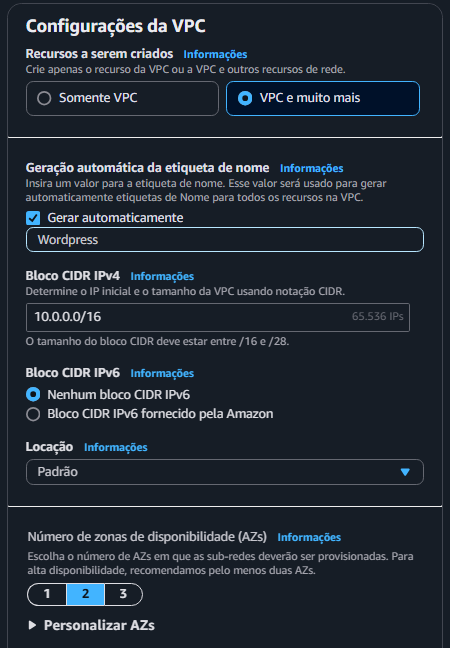
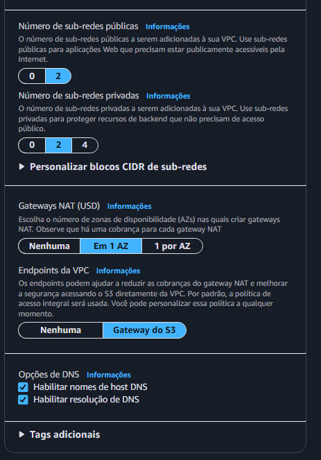

A pré visualização da sua VPC deve ficar assim:

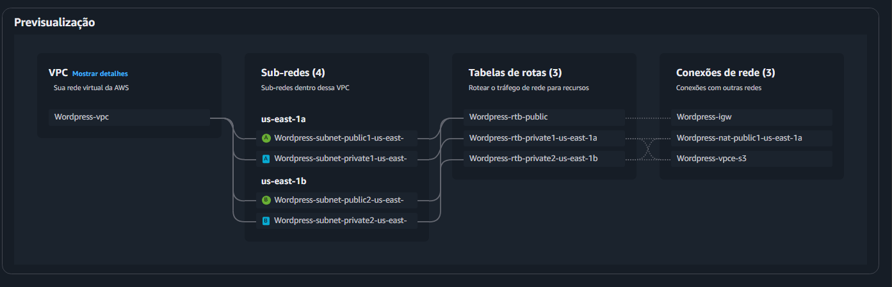

## 2. Crie os Grupos de Segurança

Acesse: `EC2 → Grupos de seguranca → Criar grupo de seguranca`

Certifique-se de nomear o grupo de segurança, informar uma descrição e `selecionar a VPC criada para o projeto`

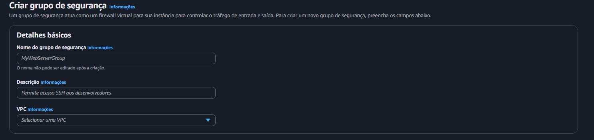

### Grupos de Segurança:

Crie os grupos de segurança conforme a tabela:

| Serviço | Nome | Regras de Entrada | Regras de Saída |
|---------|------|------------------|----------------|
| EC2 | SG-EC2 | HTTP - TCP - 80 - (SG-CLB) | MYSQL/Aurora - TCP - 3306 - (SG-RDS)<br>NFS - TCP - 2049 - (SG-EFS)<br>HTTP - TCP - 80 - (SG-CLB)<br>Todo o tráfego - Tudo - Tudo - 0.0.0.0/0 |
| Classic Load Balancer | SG-CLB | HTTP - TCP- 80- 0.0.0.0/0 - Todo trafego | HTTP - TCP - 80 - (SG-EC2) |
| EFS | SG-EFS | NFS - TCP - 2049 - (SG-EC2) | NFS - TCP - 2049 - (SG-EC2) |
| RDS MySQL | SG-RDS | MYSQL/Aurora - TCP - 3306 - (SG-EC2) | MYSQL/Aurora - TCP - 3306 - (SG-EC2) 

## 3. Criação do RDS

Acesse `Aurora and RDS → Criar banco de dados`

Selecione o mecanismo do MySQL

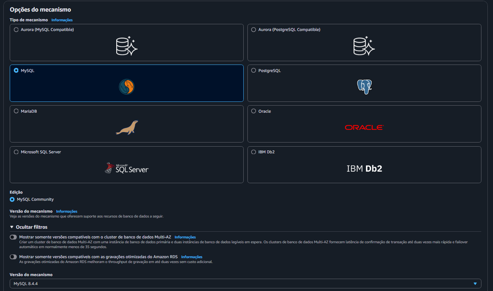

Selecione o Modelo Gratuito:

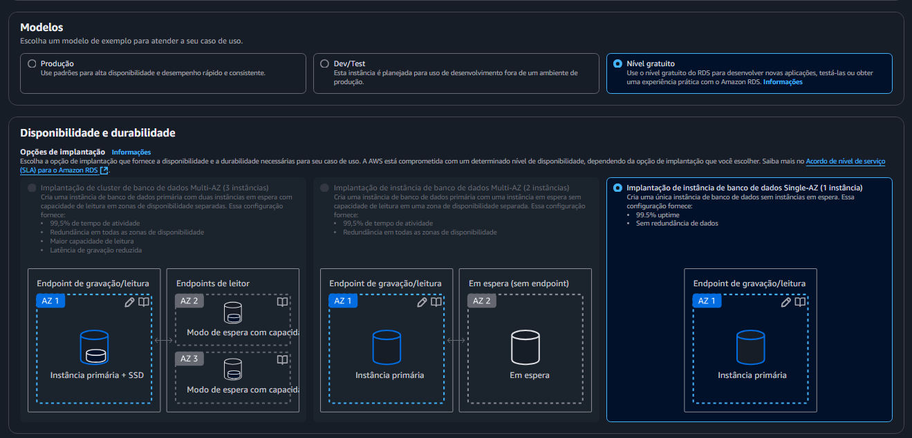

Configurações:

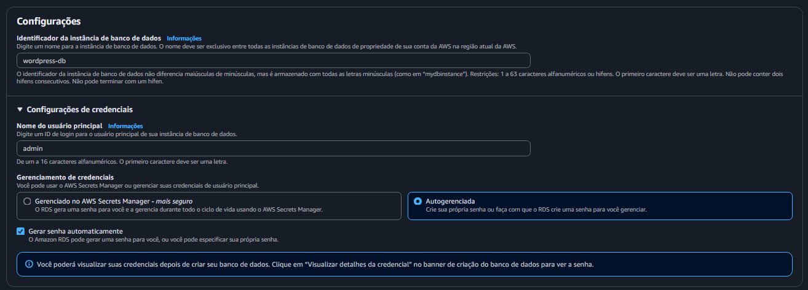
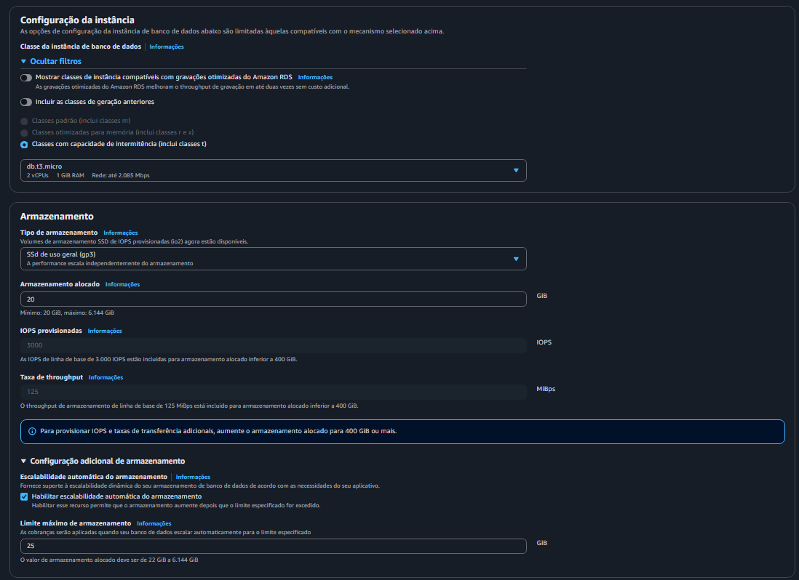
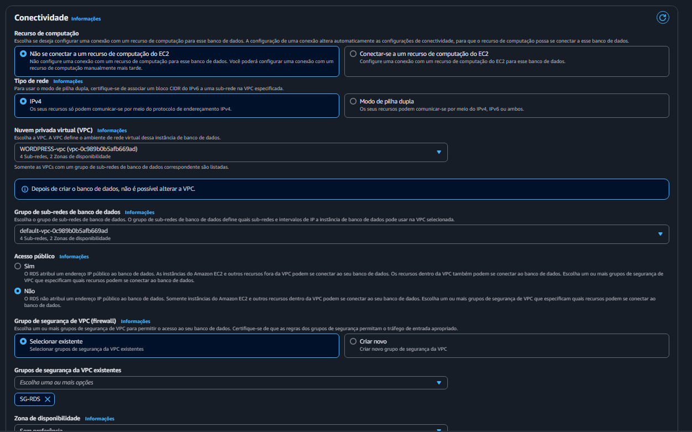

Nas configurações adicionais:

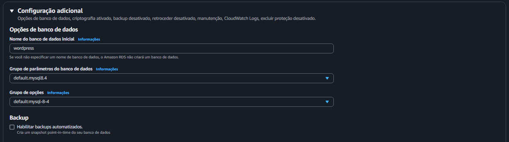

Em seguida, crie o banco de dados

Após a criação, anote a `senha do banco e seu endpoint`

## 4. Crie o EFS:

Acesse `Elastic File system → Criar sistema de arquivos` 

Crie o EFS:

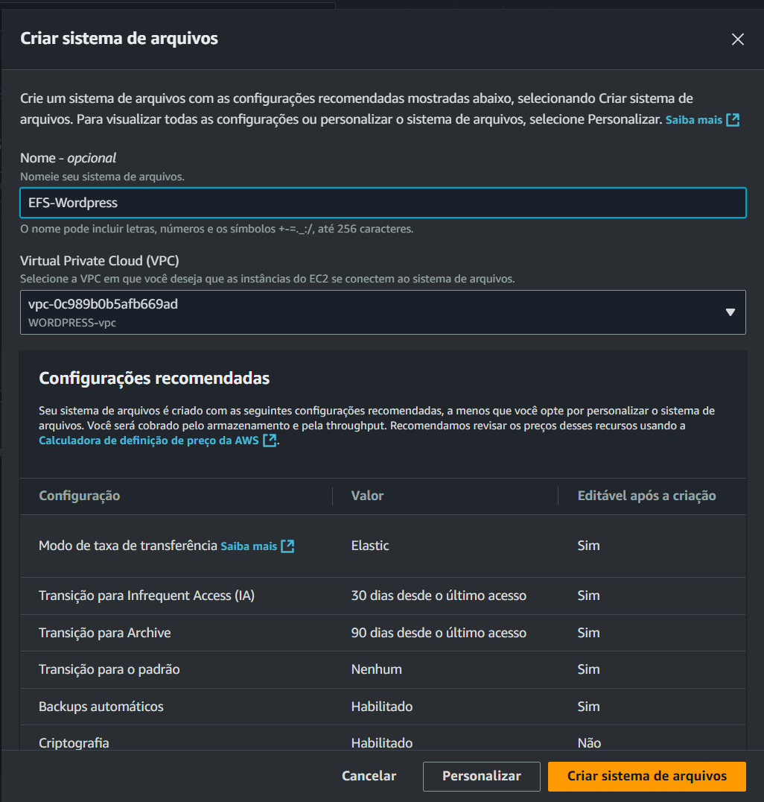

<aside>


> 💡 Não esqueça de selecionar a VPC correta

</aside>

Com o EFS criado, acesse o sistema de arquivos e vá até `Rede → Gerenciar` 

Selecione a VPC do projeto e crie 2 destinos de montagem, em seguida, atribua-os às sub-redes privadas da sua VPC.

Selecione também o Grupo de Segurança criado para o EFS.

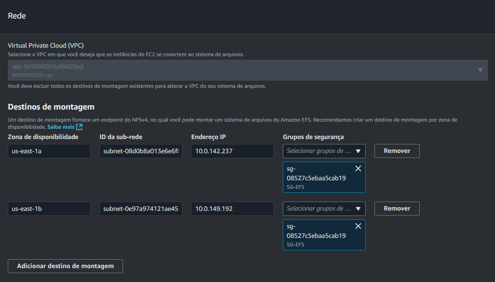

Com os destinos de montagem criados, volte para a página do EFS e clique em `anexar` 

Copie e anote a montagem usando o assistente me montagem EFS

<aside>


> 💡 A montagem deve se parecer com: `sudo mount -t efs -o tls fs-0492b12a70426e2c0:/ efs`

</aside>

## 5. Crie o Classic Load Balancer

Vá até `EC2 → Load Balancers → Criar Load Balancer`

Na tela de seleção do LB, escolha o tipo Clássico e prossiga com a criação.

Nomeie o LB, selecione o esquema `voltado para a internet` e selecione a VPC do projeto e suas sub-redes públicas:

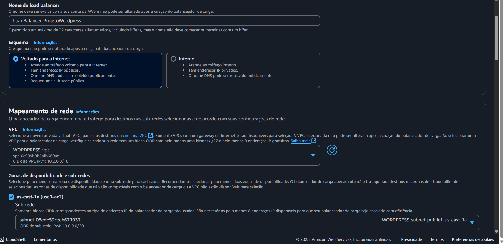

Selecione o security group criado para o Load Balancer (SG-CLB)

Nas verificações de integridade, modifique o caminho de ping para `/wp-admin/install.php` 

Crie o Load Balancer.

Resumo:

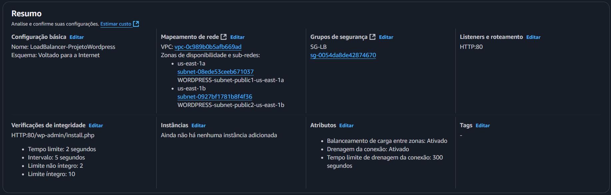

## 6.1 Criação do Docker Compose e do User Data

Em um repositório no github, crie 2 arquivos → `docker-compose.yml` e `script-user-data.txt` 

### Docker-compose

O arquivo docker-compose deve seguir esse padrão:

```yaml
services:
  wordpress:
    image: wordpress:latest
    container_name: wordpress
    restart: always
    ports:
      - "80:80"
    environment:
      WORDPRESS_DB_HOST: db-wordpress.aaaaaaaaa.us-east-1.rds.amazonaws.com:3306
      WORDPRESS_DB_USER: admin
      WORDPRESS_DB_PASSWORD: senhaDoRDS
      WORDPRESS_DB_NAME: wordpress
    volumes:
      - /data:/var/www/html
```
<aside>


> 💡 Lembre-se de substituir `WORDPRESS_DB_HOST` e `WORDPRESS_DB_PASSWORD` de acordo com o endpoint e as credenciais de seu banco.

</aside>

Com o arquivo criado, selecione a opção de visualização RAW:

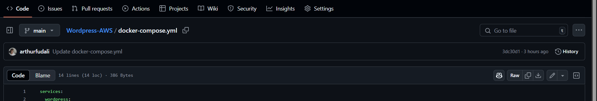

<aside>


> 💡 O  link deve se parecer com: https://raw.githubusercontent.com/arthurfudali/Wordpress-AWS/refs/heads/main/docker-compose.yml

</aside>

### User Data

No arquivo de user-data:
```bash
#!/bin/bash

# Atualiza os pacotes do sistema
yum update -y

# Instala pacotes necessários
yum install -y ca-certificates wget amazon-efs-utils

# Instala o Docker
yum install -y docker

# Inicia e habilita o serviço do Docker
systemctl enable docker
systemctl start docker

# Adiciona o usuário ec2-user ao grupo docker para evitar uso de sudo
usermod -aG docker ec2 -user

# Instala o Docker Compose manualmente
curl -L "https://github.com/docker/compose/releases/latest/download/docker-compose-$(uname -s)-$(uname -m)" -o /usr/local/bin/docker-compose
chmod +x /usr/local/bin/docker-compose
ln -s /usr/local/bin/docker-compose /usr/bin/docker-compose

# Cria o diretório de montagem do EFS
mkdir -p /data

# Monta o sistema de arquivos EFS
# Substituir pelo mount do seu EFS
[SUBSTITUA PELO SEU COMANDO DE MONTAGEM DO EFS] /data

#Pega o docker compose do github
wget -O /home/ec2-user/docker-compose.yml [SUBSTITUA PELO SEU LINK DO ARQUIVO RAW]
sudo chown ec2-user:ec2-user /home/ec2-user/docker-compose.yml

# Ajusta permissões do arquivo
chown ec2-user:ec2-user /home/ec2-user/docker-compose.yml

# Inicia os containers com Docker Compose
cd /home/ec2-user && docker-compose up -d
```

<aside>


> 💡 Não esqueça de substituir o comando de montagem e o link do docker-compose

</aside>

## 6.2 Criação do Launch Template

Acesse `EC2 → Modelos de Execução → Criar modelo de execução` 

De um nome e uma descrição para o modelo, e selecione o campo ‘Orientação sobre o Auto Scaling’

Selecione a Imagem do Amazon Linux

Selecione o tipo de instancia t2.micro

Nas configurações de rede, não selecione nenhuma sub rede e escolha o Security Group das instâncias (SG-EC2)

No campo `Tags de Recurso`, adicione as tags (se necessário) para a criação da instância

Em `Detalhes Avancados` , no campo `Dados de usuário` , cole o [script de user data](https://www.notion.so/Tarefa-Wordpress-1c163324139080d1b81cc6b716e7fa40?pvs=21) e crie o modelo.

## 7. Criação do Auto Scaling Group

Acesse `EC2 → Grupos de Auto Scaling → Criar Grupo do Auto Scaling` 

1. De um nome ao ASG e selecione o Modelo de execução (Launch Template) recém criado na sua versão `latest` 
2. Selecione a VPC do projeto e suas 2 sub-redes `privadas.` Mantenha o ‘Melhor esforço equilibrado’ selecionado.
3. Anexe ao Load Balancer Classico criado para o projeto

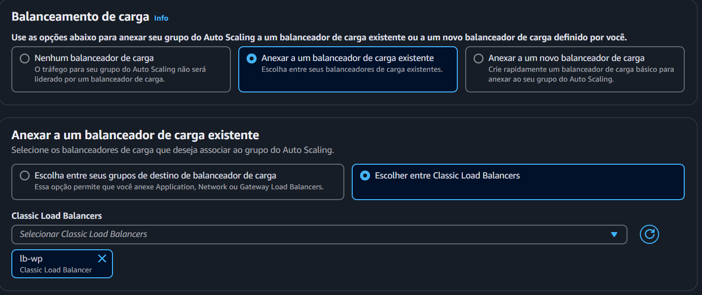

E ative a opção de `verificações de integridade do ELB`

4. Escolha a capacidade desejada de instâncias, a capacidade mínima e a capacidade máxima (para testes, recomendo usar 2, 2, 4, respectivamente). 
    
    Ative também a `coleta de métricas de grupo no CloudWatch` 
    
5. Pule a etapa 5
6. Adicione uma etiqueta para identificar as instâncias criadas pelo ASG (opcional)
7. Revise as configurações e crie o Auto Scaling Group

Agora, após se certificar que as instâncias já estão criadas em `EC2 → Instâncias,` tente acessar a página do Wordpress via o `DNS do Load Balancer`

<aside>


> 💡 A partir desse momento você já deve ser capaz de acessar as configurações iniciais do Wordpress (lembre-se que demora alguns minutos para as instâncias se configurarem e o acesso ser liberado)

> Caso o acesso não de certo, revise as configurações até agora.

</aside>

## 8. Criação de Métricas no Cloud Watch.

Em `EC2 → Grupos de Auto Scaling`

Acesse o seu ASG e vá até a aba de `Escalabilidade automática -> Criar política de escalabilidade dinâmica`

Crie a politica conforme a imagem:

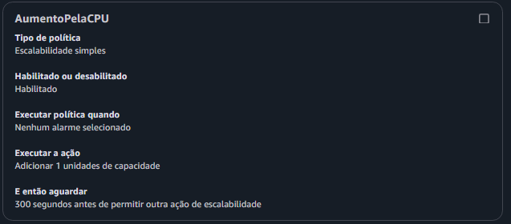

Acesse `CloudWatch → Alarmes → Criar alarme`

Selecione a métrica `EC2 → By auto scaling group,` ache o nome do seu ASG, e selecione `CPUUtilization`

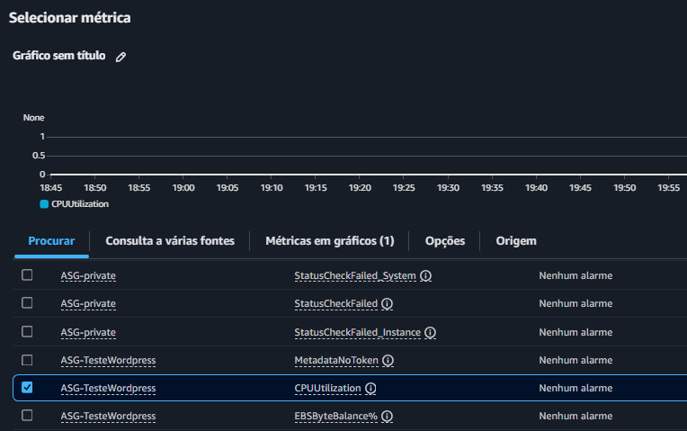

Configure a métrica:

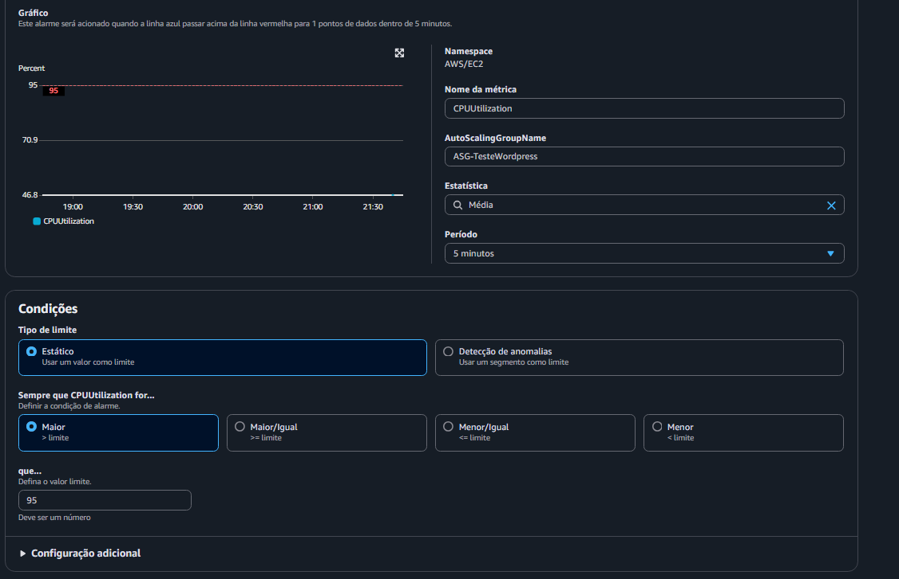

Configure as ações:

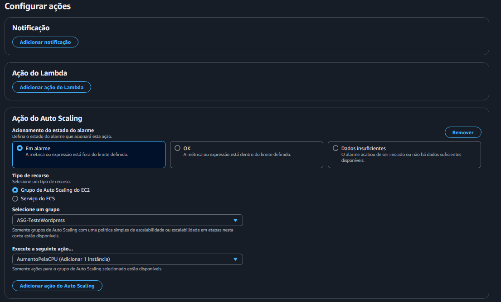

<aside>


> ⚠️ Selecione no grupo a política criada dentro do ASG

</aside>

Repita esses mesmos passos, porém com uma política para reduzir o número de Instâncias baseado na métrica adequada para seu uso

De um nome ao seu alarme, revise as configurações na etapa final, e, por ultimo, crie o alarme.

### Criação dos gráficos no CloudWatch

No Console da AWS, vá até o serviço CloudWatch

No menu lateral, clique em Dashboards

Clique em Create dashboard

Adicione os widgets: GroupTotalInstances, CPUUtilization, RequestCount, Latency, StorageBytes, PercentIOLimit, FreeStorageSpace, CPUUtilization(RDS) e os alarmes